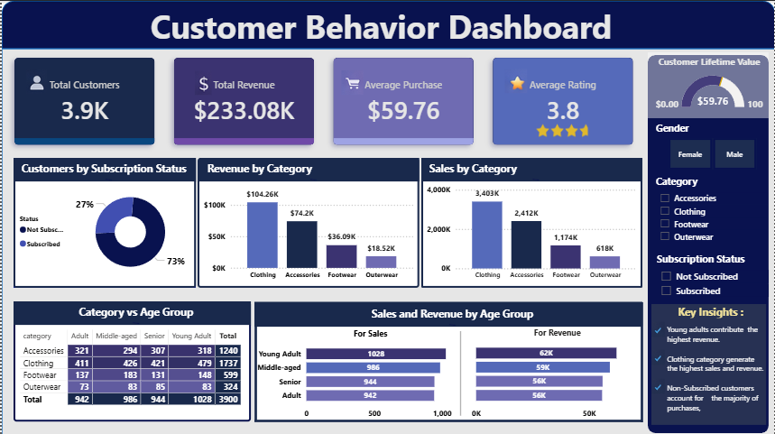

# 🛍️ Retail Customer Insights and Revenue Analytics

<p align="center">
  
</p>

# 📊 Project Overview

This project demonstrates an **end-to-end data analytics workflow** using **Python, MySQL, and Power BI.** The goal is to analyze retail customer purchasing behavior and convert raw transactional data into actionable business insights.

The project covers the complete analytics pipeline including **data loading, exploratory data analysis (EDA), data cleaning, SQL-based analysis, dashboard visualization, and reporting.** It simulates how data analysts work in real-world business environments to support data-driven decision making.

---

# 🧠 Dataset

The dataset contains **3,900 customer transaction records** from a retail business. It includes customer demographics, purchasing behavior, and product-related information.

Key features in the dataset include:

- Customer ID
- Age and Gender
- Product Category and Item Purchased
- Purchase Amount
- Shipping Type
- Subscription Status
- Review Rating
- Previous Purchases
- Discount Applied

The dataset allows analysis of **customer behavior, product performance, and revenue drivers.**

---

# 🛠️ Tools & Technologies

The project uses the following tools:

**Python (Pandas, Jupyter Notebook) –** Data loading, cleaning, and exploratory data analysis

**MySQL –** Data storage and SQL-based analysis

**SQL –** Business queries and data insights

**Power BI –** Interactive dashboard visualization

---

# 🔄 Project Workflow

Raw CSV Dataset  
↓  
Python (Data Cleaning & Feature Engineering)  
↓  
MySQL Database (Data Storage)  
↓  
SQL Analysis (Business Questions)  
↓  
Power BI Dashboard  
↓  
Business Insights & Recommendations  

---

# 🚀 Project Steps

**📥 1. Data Loading (Python)** 

The dataset was loaded into a Jupyter Notebook using **Python Pandas.** Initial exploration was performed to understand data structure, data types, and summary statistics.


**🔍 2. Exploratory Data Analysis (EDA)**

Exploratory analysis was performed to understand patterns and identify issues in the dataset.

Key tasks included:
- Checking missing values
- Understanding distributions of numerical columns
- Analyzing categorical variables
- Exploring relationships between customer demographics and purchases


**🧹 3. Data Cleaning**

The dataset was cleaned to improve data quality.

Cleaning steps included:
- Handling missing values in the review rating column
- Standardizing column names
- Creating new analytical features such as age group segmentation
- Converting purchase frequency into numeric values
- Removing redundant columns


**📈 4. Data Analysis (MYSQL)**

After cleaning, the dataset was loaded into a **MySQL database** for structured analysis.

Several SQL queries were written to answer business questions such as:
- Revenue contribution by gender
- Customers using discounts but spending above average
- Top-rated products
- Comparison of standard vs express shipping purchases
- Customer segmentation (New, Returning, Loyal)
- Top products within each category
- Revenue contribution by age group

Advanced SQL techniques such as **CTEs and window functions** were used for deeper insights.


**📊 5. Data Visualization (Power BI)**

The MySQL database was connected to **Power BI** to create an interactive dashboard.

The dashboard visualizes:
- Total customers
- Total revenue
- Average purchase value
- Revenue by product category
- Sales by category
- Customer segmentation
- Age group purchasing behavior
- Subscription status distribution

These visualizations help stakeholders easily explore trends and business insights.


**Dashboard**

The Power BI dashboard presents key performance indicators and customer insights in an interactive format.

Main components of the dashboard include:
- KPI cards showing total customers, total revenue, and average purchase value
- Category-level sales and revenue analysis
- Customer segmentation based on purchase history
- Demographic analysis by age group
- Subscription status comparison

The dashboard allows business users to quickly identify **revenue drivers, customer segments, and product trends.**

---

# 🔍 Results & Insights

The analysis produced several useful insights:
- **Young adults generate** the **highest revenue** contribution
- **Clothing category** **drives** the **largest share of sales**
- Customers choosing **express shipping tend** to **spend more**
- A **large portion of customers** **belong** to the **loyal segment**
- **Some products** show **high dependency** on **discounts for purchases**

These insights can help businesses improve marketing strategies and customer engagement.

---

# 💡 Business Recommendations

- Promote subscription programs to increase customer retention
- Optimize discount strategies to reduce dependency
- Focus marketing efforts on high-revenue age groups
- Highlight top-selling products in campaigns
- Invest in faster shipping options

---

# 📁 Repository Structure
```
Retail-Customer-Insights-Analytics/
│
├── data/
│   └── customer_shopping_behavior.csv
│
├── notebooks/
│   └── customer_shopping_behavior_analysis.ipynb
│
├── sql/
│   └── sql_queries.sql
│
├── dashboard/
│   └── customer_behavior_dashboard.png
│
└── reports/
    └── Retail_Customer_Insights_Analytics_Report.pdf
```    
---

# 👨‍💻 Author

**Krish Agrawal**  
B.Tech, NIT Raipur
Aspiring Data Analyst  

Skills: Python | SQL | Power BI | Data Analytics
